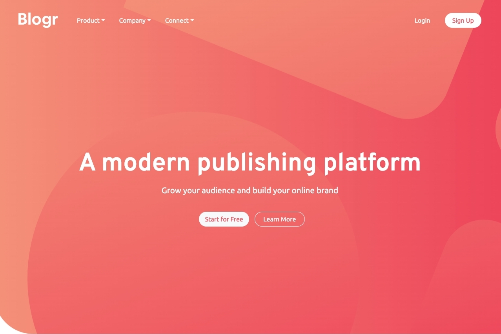

# Frontend Mentor - Blogr landing page solution

This is a solution to the [Blogr landing page challenge on Frontend Mentor](https://www.frontendmentor.io/challenges/blogr-landing-page-EX2RLAApP). 

### The challenge

Users should be able to:

- View the optimal layout for the site depending on their device's screen size
- See hover states for all interactive elements on the page

### Screenshot

### Links

- Solution URL: https://github.com/claire-illustrates/blogr
- Live Site URL: https://claire-illustrates.github.io/blogr/

## My process

I used this challenge to work on my core skills, especially layout & responsive sizing. I used Bootstrap for its grid layout and collapsible navigation component.  I added some enhancements for accessiility including using ARIA to label sections. As I didn't design the colour scheme here I will note that some elements don't meet the WCAG standard for colour contrast ratio. I changed what I could while still working with the background images provided by frontend mentor. 

### Built with

- Semantic HTML5 markup
- CSS custom properties
- Flexbox
- Bootstrap
- ARIA
- Axe Dev Tools (accessibility testing)
